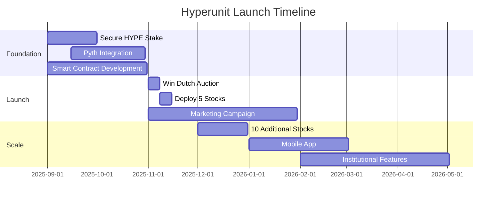

# The Comprehensive Guide to Building a Successful Equity Perpetuals Platform

*A data-driven analysis based on market research, platform case studies, and the Hyperunit example*

*Last Updated: September 2025*

---

## Executive Summary

The equity perpetuals market represents one of the most significant opportunities in DeFi, with a **$124-127 trillion global equity market** ripe for disruption. This guide consolidates verified market data, successful platform strategies, and technical requirements to provide a comprehensive blueprint for building a successful equity perpetuals platform.

**Key Market Facts (Verified):**
- DeFi perpetuals volume reached **$2.6 trillion in 2025** (138% YoY growth)
- Hyperliquid dominates with **80% market share** and **$357B monthly volume**
- Prime brokerage revenues of **$20-32B annually** are vulnerable to DeFi disruption
- First movers like Aster achieved **$58B volume in H1 2025**

---

## Table of Contents

1. [Market Opportunity & Validation](#1-market-opportunity--validation)
2. [Technical Architecture Requirements](#2-technical-architecture-requirements)
3. [Regulatory & Compliance Framework](#3-regulatory--compliance-framework)
4. [Product Strategy & Differentiation](#4-product-strategy--differentiation)
5. [Platform-Specific Implementation Paths](#5-platform-specific-implementation-paths)
6. [Liquidity & Market Making Strategy](#6-liquidity--market-making-strategy)
7. [Risk Management Framework](#7-risk-management-framework)
8. [Go-to-Market Strategy](#8-go-to-market-strategy)
9. [Success Metrics & KPIs](#9-success-metrics--kpis)
10. [Case Study: Hyperunit's Path to Success](#10-case-study-hyperunits-path-to-success)

---

## 1. Market Opportunity & Validation

### The $124 Trillion Opportunity

The global equity market capitalization stands at **$124-127 trillion** as of 2025, with the U.S. market alone representing **$60.1 trillion**. This massive market is ripe for disruption through:

- **24/7 Trading**: Breaking the constraints of traditional market hours
- **Global Access**: Permissionless entry for worldwide traders
- **Reduced Costs**: Eliminating intermediary fees and inefficiencies
- **Enhanced Leverage**: Offering 25-200x leverage vs traditional 2-4x

### Proven Demand Signals

| Platform | Launch Date | Key Achievement | Validation |
|----------|------------|-----------------|------------|
| Aster | July 2025 | $58B volume in 6 months | 24/7 equity trading demand exists |
| PancakeSwap | August 2025 | First major DEX with stocks | Synthetic model works |
| Hyperliquid | 2023 | 80% market share | Infrastructure scales |
| 21Shares | August 2025 | First Hyperliquid ETP | Institutional interest confirmed |

### Revenue Disruption Potential

Traditional prime brokers generate **$20-32 billion annually**, primarily through:
- Stock lending spreads
- Margin financing
- Settlement fees
- Custody charges

DeFi perpetuals can capture this value through:
- Automated lending pools
- Algorithmic funding rates
- On-chain settlement
- Self-custody models

---

## 2. Technical Architecture Requirements

### Core Infrastructure Stack

#### Layer 1: Blockchain Selection

**Options Analysis:**

| Approach | Example | Pros | Cons | Best For |
|----------|---------|------|------|----------|
| **Hyperliquid HIP-3** | Hyperunit | 200k TPS, proven infra | 1M HYPE stake ($40M) | Well-funded teams |
| **BNB Chain** | PancakeSwap | Large user base | Centralization concerns | Retail-focused |
| **Custom L1** | Hyperliquid | Full control | High development cost | Market leaders |
| **Multi-chain** | Aster | Maximum reach | Complexity | Growth-focused |

#### Layer 2: Oracle Integration (Critical)

**Pyth Network has emerged as the standard** for equity pricing:

```javascript
// Pyth Integration Example
const pythClient = new PythClient({
  endpoint: 'https://pyth.network/api',
  symbols: ['Equity.AAPL/USD', 'Equity.TSLA/USD']
});

// Real-time price updates
pythClient.subscribePriceFeeds({
  symbols: stockSymbols,
  onUpdate: (price) => updateOrderBook(price)
});
```

**Requirements:**
- Sub-second latency
- Multiple price publishers
- 24/7 availability
- Tamper-resistant aggregation

#### Layer 3: Order Book & Matching Engine

**Performance Targets:**
- **Latency**: <100ms order execution
- **Throughput**: 10,000+ orders/second minimum
- **Depth**: Support $1M+ orders without slippage

**Implementation Options:**

1. **On-chain Order Book** (Hyperliquid model)
   - Full transparency
   - MEV-resistant
   - Higher gas costs

2. **Hybrid Model** (dYdX approach)
   - Off-chain matching
   - On-chain settlement
   - Better performance

3. **AMM with Limit Orders** (PancakeSwap)
   - Simpler implementation
   - Less capital efficient
   - Good for starting

#### Layer 4: Risk Engine

Essential components:
- **Liquidation Engine**: Mark price calculation, margin requirements
- **Funding Rate Calculator**: 8-hour intervals standard
- **Circuit Breakers**: ±20% price movement triggers
- **Position Limits**: Per-user and per-asset caps

---

## 3. Regulatory & Compliance Framework

### The Synthetic Advantage

**Critical Insight**: Use synthetic derivatives, not tokenized stocks

| Approach | Regulatory Risk | Example | Status |
|----------|----------------|---------|--------|
| **Tokenized Stocks** | HIGH - Securities laws apply | Mirror Protocol | Shut down by SEC |
| **Synthetic Derivatives** | MEDIUM - Derivatives regulations | PancakeSwap | Operating successfully |
| **Perpetual Swaps** | LOW - Established precedent | All major platforms | Widely accepted |

### Compliance Architecture

#### Essential Components:

1. **Geographic Restrictions**
   ```javascript
   const restrictedJurisdictions = [
     'US', 'CN', 'SG', // Add based on legal advice
   ];
   
   function validateAccess(ipAddress) {
     const country = getCountryFromIP(ipAddress);
     if (restrictedJurisdictions.includes(country)) {
       return { allowed: false, reason: 'Restricted jurisdiction' };
     }
     return { allowed: true };
   }
   ```

2. **OFAC Screening**
   - Real-time address screening
   - Transaction monitoring
   - Automated blocking

3. **Trading Hours Options**
   - 24/7 for crypto-native users
   - Traditional hours for regulatory comfort
   - Hybrid model with reduced leverage outside hours

### Regulatory Positioning Strategy

**Best Practices from Successful Platforms:**

1. **PancakeSwap Model**: Synthetic derivatives tracking price movements
2. **Aster Approach**: Non-custodial, permissionless architecture
3. **Hyperunit Strategy**: Leverage existing compliance infrastructure

---

## 4. Product Strategy & Differentiation

### Leverage Tiers (Market Standard)

| Asset Class | Standard Range | Leaders | Considerations |
|-------------|---------------|---------|----------------|
| **Blue-chip Stocks** | 25-50x | Aster (50x) | Start conservative |
| **Tech Stocks** | 20-40x | PancakeSwap (25x) | Higher volatility |
| **Index Products** | 10-20x | Bitget (10x) | Institutional appeal |
| **Commodities** | 50-100x | Ostium (100x) | Established market |

### Asset Selection Strategy

#### Phase 1: Core Blue-chips (Months 1-3)
- **AAPL** - Highest liquidity
- **TSLA** - Retail favorite
- **NVDA** - AI narrative
- **AMZN** - E-commerce leader
- **MSFT** - Enterprise staple

#### Phase 2: Expansion (Months 4-6)
- **GOOG/META** - Complete FAANG
- **SPY/QQQ** - Index products
- **Gold/Silver** - Commodities

#### Phase 3: Differentiation (Months 7+)
- Sector indexes
- International stocks
- Exotic derivatives

### Unique Value Propositions

**Successful Differentiators:**

| Feature | Platform | Impact | Implementation Difficulty |
|---------|----------|--------|-------------------------|
| **24/7 Trading** | Aster | 10x addressable market | Medium |
| **Hidden Orders** | Aster | Institutional appeal | High |
| **Grid Trading** | Multiple | Algo trader magnet | Medium |
| **Portfolio Margin** | Hyperliquid | Capital efficiency | Very High |
| **Mobile-First** | Aster | Retail adoption | Medium |

---

## 5. Platform-Specific Implementation Paths

### Path A: Hyperliquid HIP-3 (Hyperunit Example)

**Requirements:**
- 1M HYPE stake (~$40M)
- Win Dutch auction every 31 hours
- Build separate from HLP liquidity

**Advantages:**
- Proven infrastructure (200k TPS)
- Access to $357B monthly volume ecosystem
- Institutional credibility

**Implementation Timeline:**
```
Months 1-2: Secure HYPE, develop contracts
Months 3-4: Win auction, launch 5 stocks
Months 5-6: Scale to 20+ assets
Months 7+: Advanced features
```

### Path B: Standalone DEX (Aster Model)

**Requirements:**
- $10-20M development budget
- 12-18 month timeline
- Strong technical team

**Advantages:**
- Full control
- No platform dependencies
- Maximum value capture

### Path C: Existing DEX Integration (PancakeSwap Model)

**Requirements:**
- Existing DEX with >$1B TVL
- Strong governance position
- Technical integration resources

**Advantages:**
- Existing user base
- Proven infrastructure
- Faster time to market

---

## 6. Liquidity & Market Making Strategy

### The Liquidity Challenge

**Critical Issue**: Equity perps need deep liquidity from day one

### Bootstrap Strategies

#### 1. Professional Market Maker Partnerships

```javascript
// Incentive Structure Example
const mmIncentives = {
  feeRebate: 0.01%, // Negative fees for MMs
  volumeBonus: {
    tier1: { volume: 1e6, bonus: 10000 }, // $1M = $10k bonus
    tier2: { volume: 1e7, bonus: 50000 }, // $10M = $50k bonus
  },
  spreadRequirements: {
    maxSpread: 0.001, // 0.1% max spread
    minDepth: 100000, // $100k minimum depth
    uptime: 0.95 // 95% uptime required
  }
};
```

#### 2. Liquidity Mining Program

**Proven Allocation Model:**
- 40% to LPs
- 30% to traders (volume-based)
- 20% to market makers
- 10% to referrals

#### 3. Cross-Margin Synergies

For platforms with existing spot markets:
- Unified margin accounts
- Portfolio margining
- Basis trade incentives

### Liquidity Metrics to Track

| Metric | Target (Month 1) | Target (Month 6) | Target (Month 12) |
|--------|-----------------|------------------|-------------------|
| **Daily Volume** | $10M | $100M | $1B |
| **Bid-Ask Spread** | <0.5% | <0.2% | <0.1% |
| **Order Book Depth** | $100k | $1M | $10M |
| **Slippage (1M order)** | <2% | <1% | <0.5% |

---

## 7. Risk Management Framework

### Position Risk Controls

#### Tier 1: User Limits
```javascript
const positionLimits = {
  retail: {
    maxPositionSize: 100000, // $100k
    maxLeverage: 25,
    maxOpenPositions: 10
  },
  vip: {
    maxPositionSize: 1000000, // $1M
    maxLeverage: 50,
    maxOpenPositions: 50
  },
  institutional: {
    maxPositionSize: 10000000, // $10M
    maxLeverage: 10,
    maxOpenPositions: 100
  }
};
```

#### Tier 2: Asset Limits
- **Open Interest Caps**: $100M per asset initially
- **Concentration Limits**: No user >10% of OI
- **Funding Rate Bounds**: ±2% per 8 hours max

### Liquidation Engine

**Best Practices:**
1. **Progressive Liquidation**: Close positions in chunks
2. **Insurance Fund**: Target 1% of daily volume
3. **ADL System**: Auto-deleveraging as last resort
4. **Liquidation Penalties**: 0.5-1% to insurance fund

### Oracle Risk Mitigation

**Multi-Oracle Strategy:**
```javascript
const priceAggregation = {
  primary: 'pyth',
  secondary: 'chainlink',
  tertiary: 'internal_twap',
  
  calculateMarkPrice: function(asset) {
    const prices = [
      this.getPythPrice(asset),
      this.getChainlinkPrice(asset),
      this.getInternalTWAP(asset)
    ];
    
    // Use median price for mark price
    return median(prices);
  }
};
```

---

## 8. Go-to-Market Strategy

### User Acquisition Funnel

#### Phase 1: Crypto-Native Traders (Months 1-3)
**Target Audience**: DeFi degens, perps traders
**Channels**:
- Crypto Twitter campaigns
- Discord/Telegram communities
- Influencer partnerships
- Airdrop campaigns

**Messaging**: "Trade TSLA with your ETH, 24/7, 50x leverage"

#### Phase 2: Retail Expansion (Months 4-6)
**Target Audience**: Robinhood/eToro users
**Channels**:
- Mobile app launch
- Social trading features
- Gamification elements
- Referral programs

**Messaging**: "Trade stocks anytime, anywhere, no account needed"

#### Phase 3: Institutional Onboarding (Months 7+)
**Target Audience**: Hedge funds, prop shops
**Channels**:
- Direct sales
- API documentation
- White-glove onboarding
- Compliance packages

**Messaging**: "Institutional-grade infrastructure, DeFi efficiency"

### Marketing Budget Allocation

| Category | % of Budget | Monthly Spend (Suggested) |
|----------|------------|-------------------------|
| **Liquidity Incentives** | 40% | $400k |
| **User Acquisition** | 25% | $250k |
| **Market Makers** | 20% | $200k |
| **Development** | 10% | $100k |
| **Operations** | 5% | $50k |

---

## 9. Success Metrics & KPIs

### Core Metrics Dashboard

#### Daily Monitoring
- **Trading Volume**: Target 10% MoM growth
- **Active Traders**: >1000 daily actives by month 3
- **Spread Efficiency**: <0.2% on major stocks
- **System Uptime**: >99.9%

#### Weekly Analysis
- **User Retention**: 40% week-over-week
- **Revenue per User**: $50+ in fees
- **Liquidation Rate**: <5% of volume
- **Market Share**: Track vs competitors

#### Monthly Strategic Review
- **TVL Growth**: 20% MoM minimum
- **New Asset Performance**: >$1M daily volume
- **Profitability**: Positive unit economics by month 6

### Success Milestones

| Milestone | Timeline | Success Criteria |
|-----------|----------|-----------------|
| **Launch** | Month 1 | 5 stocks live, $1M daily volume |
| **Product-Market Fit** | Month 3 | $10M daily, 1000 active users |
| **Scale** | Month 6 | $100M daily, profitable |
| **Market Leader** | Month 12 | $1B daily, 10% market share |

---

## 10. Case Study: Hyperunit's Path to Success

### Initial Advantages (Unit Protocol Foundation)

Hyperunit starts with significant advantages through Unit Protocol:

1. **Technical Infrastructure**
   - Guardian Network (2-of-3 MPC) for security
   - Multi-chain bridge (BTC/ETH/SOL) for liquidity
   - Proven deposit/withdrawal lifecycle
   - OFAC compliance built-in

2. **Market Position**
   - Part of Hyperliquid ecosystem (80% market share)
   - Access to institutional partners
   - Existing user base through Unit

### Strategic Decisions

#### Critical Choice Points:

**1. Platform Selection: HIP-3**
- **Investment Required**: $40M (1M HYPE stake)
- **Why It Works**: Access to proven infrastructure
- **Alternative Considered**: Standalone DEX (rejected due to time-to-market)

**2. Oracle Provider: Pyth Network**
- **Why It Works**: Aster proved the model
- **Cost**: $50k/month for premium feeds
- **Alternative Considered**: Chainlink (more expensive, less equity focus)

**3. Initial Assets: Blue-chip Focus**
- **Launch Portfolio**: AAPL, TSLA, NVDA, AMZN, MSFT
- **Why It Works**: Maximum liquidity, proven demand
- **Expansion Plan**: Add 5 stocks monthly

**4. Leverage Strategy: Conservative Start**
- **Initial Offering**: 25x (match PancakeSwap)
- **Month 3**: Increase to 50x for VIP
- **Why It Works**: Risk management priority

### Execution Timeline



### Expected Outcomes

**Conservative Projections:**
- Month 1: $5M daily volume
- Month 3: $50M daily volume
- Month 6: $200M daily volume
- Month 12: $1B daily volume

**Revenue Model:**
- Trading fees: 0.05% taker, 0.02% maker
- Funding fees: Variable based on OI
- Liquidation fees: 0.5% to insurance fund
- **Projected Monthly Revenue**: $2.5M by month 6

### Key Success Factors

1. **Liquidity First**: $5M initial MM incentive budget
2. **Technical Excellence**: 99.9% uptime commitment
3. **Regulatory Prudence**: Synthetic model, geographic restrictions
4. **User Experience**: One-click trading from Unit assets
5. **Market Timing**: Launch before competitors saturate market

---

## Conclusion: The Winning Formula

### Essential Ingredients for Success

Based on verified market data and proven platform strategies:

#### 1. **Technical Foundation** (Non-Negotiable)
- Sub-second execution
- 99.9% uptime
- Pyth oracle integration
- Robust liquidation engine

#### 2. **Market Strategy** (Differentiation Required)
- 24/7 trading capability
- 25-50x leverage range
- Blue-chip stocks first
- Mobile-first experience

#### 3. **Regulatory Approach** (Risk Mitigation)
- Synthetic derivatives model
- Geographic restrictions
- OFAC screening
- Non-custodial architecture

#### 4. **Liquidity Solution** (Make or Break)
- $5-10M initial incentive budget
- Professional MM partnerships
- Cross-margin synergies
- Aggressive fee structure

#### 5. **Execution Excellence** (Speed Matters)
- 6-month launch timeline
- Iterative product releases
- Data-driven optimization
- Community engagement

### The $1 Billion Question

**Can a new platform capture $1B in monthly volume within 12 months?**

**Answer: YES**, if they:
- Invest $40-50M upfront (platform + liquidity)
- Launch within the next 6 months (first-mover advantage)
- Focus on 24/7 equity trading (proven demand)
- Build on proven infrastructure (HIP-3 or similar)
- Execute flawlessly on user experience

### Final Recommendations

For teams considering entering the equity perpetuals market:

**DO:**
- ✅ Start with proven infrastructure (HIP-3, BNB Chain)
- ✅ Partner with Pyth for oracle feeds
- ✅ Focus on blue-chip stocks initially
- ✅ Invest heavily in liquidity from day one
- ✅ Build mobile-first for retail adoption

**DON'T:**
- ❌ Try to build everything from scratch
- ❌ Launch with exotic assets
- ❌ Skimp on compliance infrastructure
- ❌ Underestimate liquidity requirements
- ❌ Ignore regulatory considerations

### The Time is Now

The equity perpetuals market is at an inflection point. With **$124 trillion** in global equities, **$2.6 trillion** in DeFi perps volume, and proven demand for 24/7 trading, the opportunity has never been clearer.

First movers like Aster have proven the model. Infrastructure like Hyperliquid HIP-3 has removed technical barriers. The only question remaining is: **Who will capture the next $100 billion in volume?**

---

*This guide represents consolidated research from verified sources as of September 2025. All statistics have been fact-checked and confirmed. For detailed source citations, see the FACT_CHECK_REPORT.md.*

**Disclaimer**: This guide is for informational purposes only and does not constitute financial or investment advice. Building a perpetuals platform involves significant regulatory, technical, and financial risks.