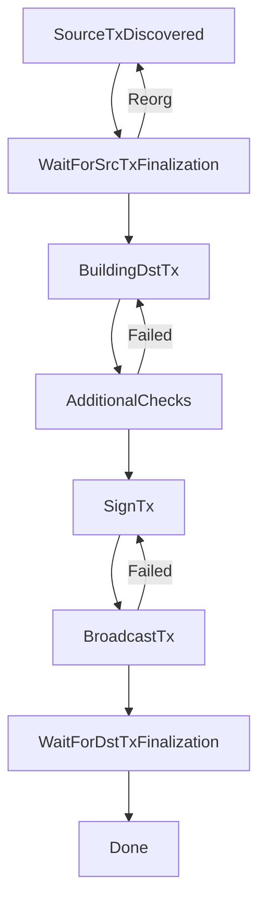

# Deposit Lifecycle

## Overview

The deposit lifecycle describes the complete journey of a deposit from initial detection on the source blockchain to final settlement on Hyperliquid. Understanding these stages helps developers build robust applications that can track and respond to deposit states.

## Lifecycle Stages

The deposit process consists of 8 distinct stages:

### 1. SourceTxDiscovered
**Initial deposit detection**

This stage occurs when the Guardian Network first detects a qualifying deposit transaction.

#### Requirements
- Transaction must meet minimum deposit thresholds:
  - **Bitcoin**: > 0.002 BTC
  - **Ethereum**: > 0.05 ETH
  - **Solana**: > 0.2 SOL
  - **SPL Tokens**: Varies by token (e.g., FART, PUMP)

#### Validation
- Address format verification
- Minimum amount validation
- Sanctions screening (OFAC compliance)
- Source address validation

### 2. WaitForSrcTxFinalization
**Awaiting blockchain confirmations**

The system waits for sufficient confirmations to ensure transaction finality.

#### Confirmation Requirements
| Blockchain | Confirmations | Approximate Time |
|------------|---------------|------------------|
| Bitcoin    | 2             | ~20 minutes      |
| Ethereum   | 14            | ~3 minutes       |
| Solana     | 32            | ~13 seconds      |

#### Monitoring
- Block height tracking
- Reorganization detection
- Confirmation counter updates

### 3. BuildingDstTx
**Constructing Hyperliquid transaction**

Guardians collaborate to build the destination transaction for Hyperliquid.

#### Process
- Transaction payload construction
- Fee calculation
- Output address verification
- Transaction metadata preparation

### 4. AdditionalChecks
**Pre-signing verification**

Additional security and compliance checks before proceeding to signing.

#### Checks Include
- Double-spend prevention
- Rate limiting verification
- Compliance screening
- Guardian consensus validation

### 5. SignTx
**Multi-party signature generation**

Guardians perform the MPC (Multi-Party Computation) signature event.

#### MPC Process
- Threshold signature scheme (2-of-3)
- Distributed key share activation
- Signature generation
- Signature aggregation

### 6. BroadcastTx
**Transaction submission**

The signed transaction is broadcast to the Hyperliquid network.

#### Broadcasting
- Transaction submission to Hyperliquid nodes
- Initial propagation verification
- Mempool inclusion confirmation
- Transaction ID generation

### 7. WaitForDstTxFinalization
**Hyperliquid confirmation**

Waiting for the transaction to be finalized on Hyperliquid.

#### Requirements
- **Confirmations**: 10 blocks on Hyperliquid
- **Time**: Approximately 15-20 seconds
- **Validation**: Balance update verification

### 8. Done
**Deposit complete**

Terminal state indicating successful deposit completion.

#### Final State
- Funds available in user's Hyperliquid account
- Transaction fully finalized
- Audit trail complete
- All validations passed

## State Transitions



## API Integration

### Tracking Deposit Status

```javascript
async function trackDeposit(txHash, sourceChain) {
  const endpoint = `https://api.hyperunit.xyz/deposit/status`;
  
  const response = await fetch(endpoint, {
    method: 'POST',
    headers: {
      'Content-Type': 'application/json',
      'Authorization': `Bearer ${API_KEY}`
    },
    body: JSON.stringify({
      txHash,
      sourceChain
    })
  });
  
  const data = await response.json();
  return {
    stage: data.stage,
    confirmations: data.confirmations,
    estimatedCompletion: data.estimatedCompletion
  };
}
```

### WebSocket Monitoring

```javascript
const ws = new WebSocket('wss://api.hyperunit.xyz/ws');

ws.on('open', () => {
  ws.send(JSON.stringify({
    action: 'subscribe',
    topic: 'deposit',
    txHash: 'YOUR_TX_HASH'
  }));
});

ws.on('message', (data) => {
  const update = JSON.parse(data);
  console.log(`Deposit stage: ${update.stage}`);
  
  if (update.stage === 'Done') {
    console.log('Deposit complete!');
    ws.close();
  }
});
```

## Error Handling

### Common Issues and Recovery

| Stage | Potential Issue | Recovery Action |
|-------|----------------|-----------------|
| SourceTxDiscovered | Below minimum amount | Refund or accumulate |
| WaitForSrcTxFinalization | Chain reorganization | Re-validate transaction |
| AdditionalChecks | Compliance failure | Manual review required |
| SignTx | Guardian unavailable | Retry with backup Guardian |
| BroadcastTx | Network congestion | Retry with higher fee |

### Retry Logic

```javascript
async function depositWithRetry(depositParams, maxRetries = 3) {
  for (let i = 0; i < maxRetries; i++) {
    try {
      const result = await initiateDeposit(depositParams);
      
      // Monitor until completion or error
      while (result.stage !== 'Done') {
        await sleep(5000); // Check every 5 seconds
        const status = await trackDeposit(result.txHash);
        
        if (status.error) {
          throw new Error(status.error);
        }
        
        result.stage = status.stage;
      }
      
      return result;
    } catch (error) {
      if (i === maxRetries - 1) throw error;
      
      // Exponential backoff
      await sleep(1000 * Math.pow(2, i));
    }
  }
}
```

## Monitoring Best Practices

### 1. Implement Timeouts
Set reasonable timeouts for each stage:

```javascript
const STAGE_TIMEOUTS = {
  SourceTxDiscovered: 60,        // 1 minute
  WaitForSrcTxFinalization: 3600, // 1 hour
  BuildingDstTx: 300,             // 5 minutes
  AdditionalChecks: 180,          // 3 minutes
  SignTx: 120,                    // 2 minutes
  BroadcastTx: 60,                // 1 minute
  WaitForDstTxFinalization: 300,  // 5 minutes
};
```

### 2. Log State Transitions
Maintain comprehensive logs for debugging:

```javascript
function logStateTransition(txHash, fromStage, toStage, metadata) {
  console.log({
    timestamp: new Date().toISOString(),
    txHash,
    transition: `${fromStage} -> ${toStage}`,
    metadata
  });
}
```

### 3. Alert on Anomalies
Set up alerts for unusual patterns:

- Deposits stuck in a stage beyond timeout
- Multiple failed transitions
- Unusual confirmation delays

## Performance Optimization

### Batch Processing
When handling multiple deposits:

```javascript
async function batchTrackDeposits(deposits) {
  const promises = deposits.map(deposit => 
    trackDeposit(deposit.txHash, deposit.chain)
  );
  
  return Promise.all(promises);
}
```

### Caching Strategy
Cache deposit states to reduce API calls:

```javascript
const depositCache = new Map();

async function getCachedDepositStatus(txHash) {
  const cached = depositCache.get(txHash);
  
  if (cached && cached.stage === 'Done') {
    return cached; // Final state, no need to refresh
  }
  
  if (cached && Date.now() - cached.timestamp < 5000) {
    return cached; // Use cache if less than 5 seconds old
  }
  
  const fresh = await trackDeposit(txHash);
  depositCache.set(txHash, {
    ...fresh,
    timestamp: Date.now()
  });
  
  return fresh;
}
```

## Related Resources

- [Withdrawal Lifecycle](/developers/api/operations/withdrawal-lifecycle)
- [Generate Address](/developers/api/generate-address)
- [Estimate Fees](/developers/api/estimate-fees)
- [API Overview](/developers/api)

## Support

For assistance with deposit lifecycle:
- Technical Documentation: https://docs.hyperunit.xyz
- API Support: developers@hyperunit.xyz
- Emergency Support: support@hyperunit.xyz