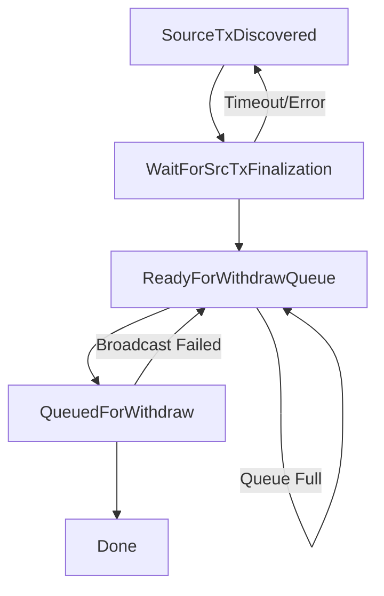

# Withdrawal Lifecycle

## Overview

The withdrawal lifecycle describes the complete process of withdrawing assets from Hyperliquid to external blockchains. This documentation covers all stages from initial withdrawal request to final settlement on the destination blockchain.

## Lifecycle Stages

The withdrawal process consists of 5 distinct stages:

### 1. SourceTxDiscovered
**Initial withdrawal detection**

This stage begins when a withdrawal request is detected in a Hyperliquid block.

#### Trigger Conditions
- Hyperliquid transfer to a Unit withdrawal address
- Amount exceeds minimum withdrawal threshold
- Valid destination address format

#### Validation Steps
- Destination address format verification
- Minimum amount validation
- Sanctions screening (OFAC compliance)
- Balance verification

### 2. WaitForSrcTxFinalization
**Hyperliquid confirmation period**

The system waits for sufficient confirmations on the Hyperliquid network.

#### Requirements
- **Confirmations Required**: 5000 blocks
- **Approximate Time**: 8-9 minutes
- **Purpose**: Ensure transaction finality and prevent double-spending

#### Monitoring
- Block height tracking
- Finality verification
- State consistency checks

### 3. ReadyForWithdrawQueue
**Queue staging**

Withdrawal is staged for batch processing based on network constraints.

#### Queue Management
- Withdrawals grouped by destination blockchain
- Batch size optimization
- Priority ordering (FIFO by default)

#### Batching Schedule
| Network | Batch Frequency | Approximate Interval |
|---------|----------------|---------------------|
| Bitcoin | Every 3 blocks | ~30 minutes |
| Ethereum | Every 21 slots | ~4 minutes |
| Solana | Every 100 slots | ~40 seconds |

#### Queue Position
- `positionInWithdrawQueue` indicates order
- Position 0 = next to be processed
- Higher numbers = longer wait time

### 4. QueuedForWithdraw
**Active processing**

Withdrawal included in an active batch for processing.

#### Processing Steps
1. Batch transaction construction
2. Multi-party signature generation
3. Transaction broadcast to destination network
4. Transaction hash generation

#### Tracking
- Destination transaction hash available
- Can be monitored on blockchain explorers
- Real-time status updates via API

### 5. Done
**Withdrawal complete**

Terminal state indicating successful withdrawal completion.

#### Final State
- Funds delivered to destination address
- Transaction finalized on destination blockchain
- All confirmations complete
- Audit trail finalized

## State Transitions



## API Integration

### Initiate Withdrawal

```javascript
async function initiateWithdrawal(params) {
  const endpoint = 'https://api.hyperunit.xyz/withdraw/initiate';
  
  const response = await fetch(endpoint, {
    method: 'POST',
    headers: {
      'Content-Type': 'application/json',
      'Authorization': `Bearer ${API_KEY}`
    },
    body: JSON.stringify({
      asset: params.asset,
      amount: params.amount,
      destinationAddress: params.destinationAddress,
      sourceAddress: params.hyperliquidAddress
    })
  });
  
  return response.json();
}
```

### Track Withdrawal Status

```javascript
async function trackWithdrawal(withdrawalId) {
  const endpoint = `https://api.hyperunit.xyz/withdraw/status/${withdrawalId}`;
  
  const response = await fetch(endpoint, {
    headers: {
      'Authorization': `Bearer ${API_KEY}`
    }
  });
  
  const data = await response.json();
  
  return {
    stage: data.stage,
    queuePosition: data.positionInWithdrawQueue,
    destinationTxHash: data.destinationTxHash,
    estimatedCompletion: data.estimatedCompletion
  };
}
```

### WebSocket Real-time Updates

```javascript
const ws = new WebSocket('wss://api.hyperunit.xyz/ws');

ws.on('open', () => {
  ws.send(JSON.stringify({
    action: 'subscribe',
    topic: 'withdrawal',
    withdrawalId: 'YOUR_WITHDRAWAL_ID'
  }));
});

ws.on('message', (data) => {
  const update = JSON.parse(data);
  
  switch(update.stage) {
    case 'ReadyForWithdrawQueue':
      console.log(`Queue position: ${update.queuePosition}`);
      break;
    case 'QueuedForWithdraw':
      console.log(`Processing. Tx hash: ${update.txHash}`);
      break;
    case 'Done':
      console.log('Withdrawal complete!');
      ws.close();
      break;
  }
});
```

## Queue Management

### Check Queue Status

```javascript
async function getQueueStatus() {
  const response = await fetch('https://api.hyperunit.xyz/withdrawal-queue');
  const data = await response.json();
  
  return {
    bitcoin: {
      queueLength: data.bitcoin.withdrawalQueueLength,
      lastProcessed: data.bitcoin.lastWithdrawQueueOperationTxID,
      estimatedWait: data.bitcoin.withdrawalQueueLength * 30 // minutes
    },
    ethereum: {
      queueLength: data.ethereum.withdrawalQueueLength,
      lastProcessed: data.ethereum.lastWithdrawQueueOperationTxID,
      estimatedWait: data.ethereum.withdrawalQueueLength * 4 // minutes
    }
  };
}
```

### Estimate Completion Time

```javascript
function estimateCompletionTime(queuePosition, network) {
  const batchIntervals = {
    bitcoin: 30 * 60 * 1000,  // 30 minutes in ms
    ethereum: 4 * 60 * 1000,   // 4 minutes in ms
    solana: 40 * 1000          // 40 seconds in ms
  };
  
  const estimatedMs = queuePosition * batchIntervals[network];
  const completionTime = new Date(Date.now() + estimatedMs);
  
  return {
    estimatedTime: completionTime,
    minutesRemaining: Math.ceil(estimatedMs / 60000)
  };
}
```

## Error Handling

### Common Issues

| Stage | Issue | Resolution |
|-------|-------|------------|
| SourceTxDiscovered | Invalid destination address | Verify address format |
| WaitForSrcTxFinalization | Timeout | Check Hyperliquid network status |
| ReadyForWithdrawQueue | Queue congestion | Wait for batch processing |
| QueuedForWithdraw | Broadcast failure | Automatic retry |
| Done | Not received | Check blockchain explorer |

### Retry Strategy

```javascript
async function withdrawWithRetry(params, maxRetries = 3) {
  let lastError;
  
  for (let attempt = 0; attempt < maxRetries; attempt++) {
    try {
      // Initiate withdrawal
      const withdrawal = await initiateWithdrawal(params);
      
      // Monitor until completion
      while (true) {
        const status = await trackWithdrawal(withdrawal.id);
        
        if (status.stage === 'Done') {
          return {
            success: true,
            txHash: status.destinationTxHash
          };
        }
        
        if (status.error) {
          throw new Error(status.error);
        }
        
        // Wait before next check
        await sleep(10000); // 10 seconds
      }
    } catch (error) {
      lastError = error;
      
      // Exponential backoff
      await sleep(Math.pow(2, attempt) * 1000);
    }
  }
  
  throw lastError;
}
```

## Performance Optimization

### Batch Withdrawals

For multiple withdrawals, coordinate timing:

```javascript
async function optimizeBatchWithdrawals(withdrawals) {
  // Group by network
  const grouped = withdrawals.reduce((acc, w) => {
    acc[w.network] = acc[w.network] || [];
    acc[w.network].push(w);
    return acc;
  }, {});
  
  // Submit in optimal order
  const results = [];
  for (const [network, items] of Object.entries(grouped)) {
    // Submit all withdrawals for this network
    const promises = items.map(item => initiateWithdrawal(item));
    const networkResults = await Promise.all(promises);
    results.push(...networkResults);
  }
  
  return results;
}
```

### Queue Position Optimization

```javascript
async function findOptimalWithdrawalTime(network) {
  const queueStatus = await getQueueStatus();
  const currentQueue = queueStatus[network].queueLength;
  
  // If queue is empty or short, process immediately
  if (currentQueue < 5) {
    return 'now';
  }
  
  // Otherwise, suggest waiting for next batch
  const batchTimes = {
    bitcoin: 30,
    ethereum: 4,
    solana: 0.67
  };
  
  return {
    waitMinutes: batchTimes[network],
    currentQueueLength: currentQueue
  };
}
```

## Monitoring Best Practices

### 1. Set Stage Timeouts

```javascript
const STAGE_TIMEOUTS = {
  SourceTxDiscovered: 60,           // 1 minute
  WaitForSrcTxFinalization: 600,    // 10 minutes
  ReadyForWithdrawQueue: 7200,      // 2 hours
  QueuedForWithdraw: 3600,          // 1 hour
};

async function monitorWithTimeout(withdrawalId) {
  const startTime = Date.now();
  let lastStage = null;
  let stageStartTime = Date.now();
  
  while (true) {
    const status = await trackWithdrawal(withdrawalId);
    
    if (status.stage !== lastStage) {
      lastStage = status.stage;
      stageStartTime = Date.now();
    }
    
    const stageElapsed = (Date.now() - stageStartTime) / 1000;
    if (stageElapsed > STAGE_TIMEOUTS[status.stage]) {
      throw new Error(`Timeout in stage: ${status.stage}`);
    }
    
    if (status.stage === 'Done') {
      return status;
    }
    
    await sleep(5000);
  }
}
```

### 2. Queue Analytics

```javascript
async function analyzeQueuePerformance() {
  const samples = [];
  
  // Collect samples over time
  for (let i = 0; i < 24; i++) { // 24 hours
    const status = await getQueueStatus();
    samples.push({
      timestamp: new Date(),
      bitcoin: status.bitcoin.queueLength,
      ethereum: status.ethereum.queueLength
    });
    
    await sleep(3600000); // 1 hour
  }
  
  // Analyze patterns
  return {
    averageQueueLength: calculateAverage(samples),
    peakTimes: findPeakTimes(samples),
    optimalWithdrawalTimes: findOptimalTimes(samples)
  };
}
```

## Related Resources

- [Deposit Lifecycle](/developers/api/operations/deposit-lifecycle)
- [Withdraw Queue API](/developers/api/withdraw-queue)
- [Estimate Fees](/developers/api/estimate-fees)
- [API Overview](/developers/api)

## Support

For assistance with withdrawals:
- Technical Documentation: https://docs.hyperunit.xyz
- API Support: developers@hyperunit.xyz
- Urgent Issues: support@hyperunit.xyz